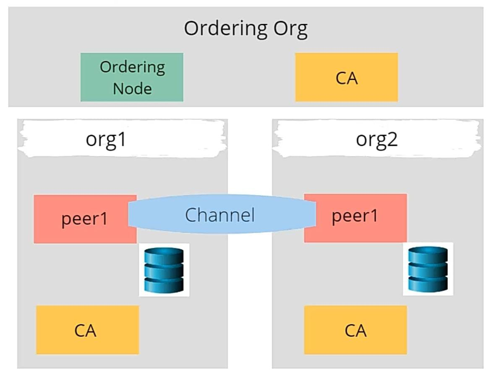
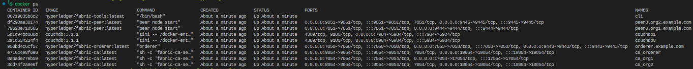
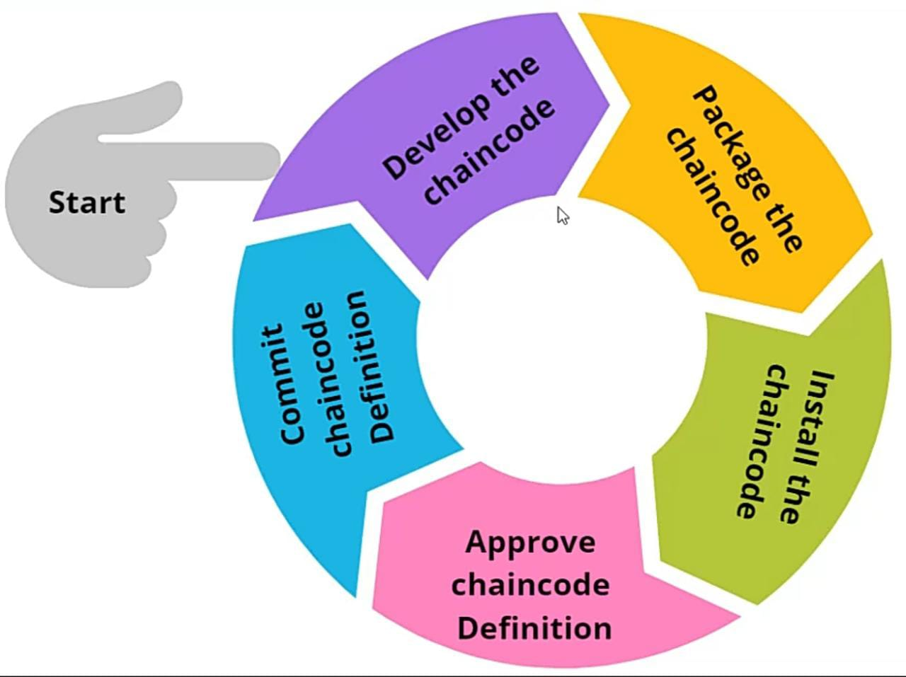

# Hyperledger Fabric - A Test Network and Chaincode Deployment Guide

## Introduction
* Hyperledger Fabric is a permissioned blockchain platform that is designed for enterprise use cases. It was developed under the Hyperledger Project, an open source collaborative effort created to advance cross-industry blockchain technologies.

* Some key features of Hyperledger Fabric include:
  * Modularity: Hyperledger Fabric allows users to plug in various components, such as consensus and membership services, making it suitable for a wide range of applications.
  * Performance: Hyperledger Fabric is optimized for high performance, with the ability to support thousands of transactions per second.
  * Privacy: Hyperledger Fabric provides a high degree of privacy for users, through the use of channels and private data collections.
  * Security: Hyperledger Fabric incorporates several security measures, including secure communication channels, digital certificates, and identity management.
  * Scalability: Hyperledger Fabric is designed to be scalable, with the ability to support large networks with many participants.

* Overall, Hyperledger Fabric is a powerful platform for building enterprise-grade blockchain applications that require high performance, privacy, security, and scalability.
* Here in this article, we will discuss how to setup a Hyperledger Fabric network locally and deploy a sample chaincode on it.

## Hyperledger Fabric Networks
* In Hyperledger Fabric, a network is a group of peer nodes that are configured to work together to perform a specific task or process. Each peer node in the network runs an instance of the Hyperledger Fabric software and is responsible for executing transactions, validating blocks, and maintaining the ledger.
* In general, a Hyperledger Fabric network is composed of the following components:
    * Peer nodes: These are the nodes that make up the network and are responsible for executing transactions, validating blocks, and maintaining the ledger.
    * Orderer nodes: These nodes are responsible for ordering transactions and creating blocks, which are then distributed to the peer nodes for validation and inclusion in the ledger.
    * Chaincode: This is the code that is executed on the peer nodes to perform the specific tasks or processes that are required by the network.
    * Ledger: The ledger is a distributed database that contains a record of all the transactions that have occurred on the network. It is maintained by the peer nodes and is used to ensure the integrity and consistency of the network.
* Hyperledger fabric currently supports two types of networks:
    * **Test Network** - A network that is meant to be used for development and testing purposes.
    * **Enterprise Network** - A network that is meant to be used for production purposes.
* HF V1.X used to support a third type of network called **Dev Network** with only single peer in it. This network type is no longer supported in HF V2.X.


## Nodes in HF Network
* Nodes in HF network are mainly classidied into two types:
    * **Peer Nodes** - These are the nodes that make up the network and are responsible for executing transactions, validating blocks, and maintaining the ledger.
    * **Orderer Nodes** - These nodes are responsible for ordering transactions and creating blocks, which are then distributed to the peer nodes for validation and inclusion in the ledger.
* There are two types of peer nodes: **endorser peers** and **committing peers**.****
* Endorser peers are responsible for executing transactions and simulating their effects on the ledger. When a client submits a transaction to the network, the transaction is first sent to the endorser peers, which execute the transaction and generate a proposal. The proposal includes a read-write set, which lists the changes that would be made to the ledger if the transaction were to be committed.
* Committing peers are responsible for validating transactions and writing them to the ledger. When a proposal is received from the endorser peers, the committing peers validate the transaction and the read-write set to ensure that they are valid and that they follow the rules of the network. If the transaction is valid, the committing peers write it to the ledger and send a message to the endorser peers indicating that the transaction has been committed.
* Both endorser peers and committing peers play important roles in the functioning of a Hyperledger Fabric network. Endorser peers are responsible for executing transactions and generating proposals, while committing peers are responsible for validating transactions and writing them to the ledger. Together, they ensure the integrity and consistency of the network.

## Test Network
* HF Test Network supports one or more organizations with each organization having one or more peers. The network also supports a single orderer peer. The network is meant to be used for development and testing purposes.
* To start the network locally download all the required docker images, binaries and [samples repo](https://github.com/hyperledger/fabric-samples) to setup peers and network by running the following command:
```bash
curl -sSL https://bit.ly/2ysbOFE | bash -s
```
* This will run [following commands](docs/download_script.sh) in terminal and download many HF docker images, create fabric-samples directory and chaincodeLifeCycle.sh script.
* By default, the test network provided by fabric-samples will create a network with a single ordering service node(with its CA) and two organizations with there own peer, CA(Certificate Authority) and couchDB: 

    
* To create and perform operations on the network, we will use the [test network script](fabric-samples/test-network/network.sh) provided by fabric-samples.
* To start the network, run the following command:
```bash
./fabric-samples/test-network/network.sh up -verbose -ca -s couchdb
# up: command to bring up orderer and peer nodes(runs 3 containers, 1 orderer and 2 peers of 2 organization)
# -s <dbtype> - peer state database to deploy: goleveldb (default) or couchdb. (runs 2 containers, each per peer)
# -ca: to deploy CA for orderer and each organization(runs 3 containers, 1 CA for orderer and 2 CAs for organizations)
# -verbose: to print the detailed logs of the containers
```
* This command will create a total of 9 containers including a cli container:


* To create a channel, run the following command:
```bash
./fabric-samples/test-network/network.sh createChannel -c mychannel
# this command will add all the peers to the channel
# -c: channel name
```
* To check list of channels a peer is joined to, run the following command:
```bash
docker exec <peer_container_name> peer channel list
```
* To shut down the network, run the following command:
```bash
./fabric-samples/test-network/network.sh down
```
## Chaincode Lifecycle
* Chaincode is a program that contains the business logic of the network. It is installed on the peer nodes and is used to create transactions that are then sent to the network for validation and execution. Chaincode is also called as smart contracts(especially in Ethereum).
* We can perform only 2 data tasks using chaincode: **update** and **query** ledger. Hence once the data is written to the ledger, it can neither be deleted nor modified.
* Logic of our simple chaincode is written [here](chaincode/main.go)
* Five stages of Chaincode Lifecycle:
  * Develop - Write chaincode in any language supported by HF.
  * Package - Embed chaincode into a package.
  * Install - Install chaincode on peer nodes.
  * Approve - Approve chaincode on peer nodes.
  * Commit - Commit chaincode on peer nodes.
  
    

### Chaincode Develop
